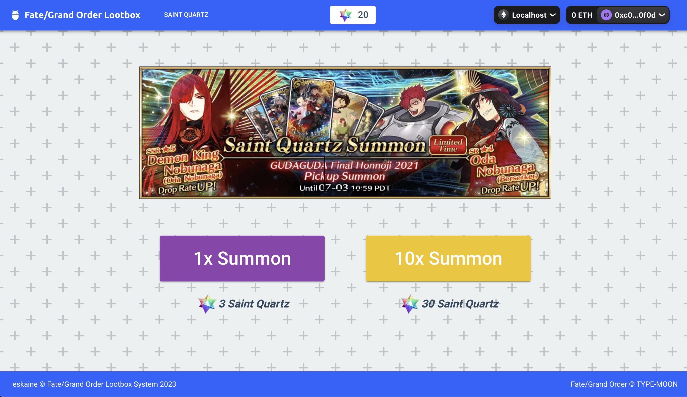

# Metana Capstone Project 1 - Fate/Grand Order NFT Gacha

Re-implementation of a mobile game gacha system ([Fate/Grand Order](https://fate-go.us)) as a NFT gacha system. A gacha system (loot-box system) is a system 
whereby players attempt to get their favourite characters through the use of a random-number generator(RNG) based 
on a set percentage.

## Important Notes

This is more of a proof-of-concept that a Gacha system works on a blockchain. Realistically speaking for this to work
in an actual real-world game, a more comprehensive assessment of the business model will be required due to the additional cost of gas and the price of ether being added to the equation as well as how does the nature of blockchain operations affect the gameplay loop and the overall gaming experience.

## Gacha Flow

1. Purchase Saint Quartz(ERC 20) with Ether.
2. Purchase NFT with Saint Quartz.
    - A single purchase of 1 NFT with 3 Saint Quartz OR
    - A single purchase of 10 NFT with 30 Saint Quartz
3. NFTs will be minted to user account.

## Implementation Breakdown

- ### Saint Quartz
    - In-game currency, implemented as ERC-20 tokens. These will be purchasable with ether in round numbers.
    - Non-transferable between users.
    - Burned on use.
- ### Servants (Characters)
    Implemented as ERC-1155 rather than ERC-721 as there's no unique copies of each characters. But the amount of each individual characters will depend on the number of players purchasing as well as the dependence on RNG.

    Rates of the characters will be based on the following using the oracle, Chainlink VRF.
    
    - 5 Star, 1% 
    - 4 Star, 3% 
    - 3 Star, 40%

## Standards
